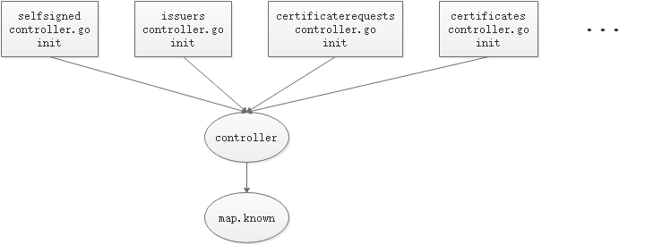
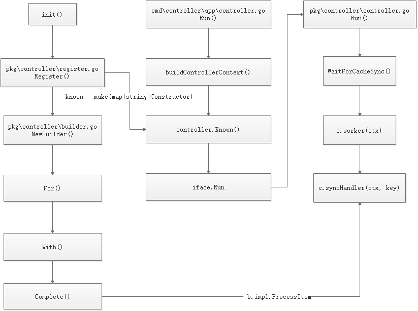

# cert-manager源码分析

Source Code From
https://github.com/cert-manager/cert-manager/releases/tag/v1.7.2

## 目录

-   [Kubernetes源码分析](#kubernetes源码分析)
    -   [目录](#目录)
    -   [源码目录结构说明](#源码目录结构说明)
    -   [架构解析](#架构解析)
        -   [各controller的注册流程](#各controller的注册流程)
    
    
## 源码目录结构说明
| 源码目录 | 说明 |
| :----: | :---- |
| cmd/ | Operator的入口，其中初始化manager结构体来注册所有pkg/apis/...中的custom resource，同时启动所有pkg/controllers/...中的控制器。 |
| deploy/ | Operator在Kubernetes集群中部署相关的对应模板，包括CRD注册模板，建立RBAC角色和绑定的模板，以及Operator部署模版。 |
| pkg/apis | CRD对应的API接口定义，用户需要在指定的pkg/apis/<group>/<version>/<kind>_types.go 文件中为每个应用资源类型进行相应的API定义，同时需要通过在控制器中引用这些目录来完成对指定应用资源的监听。 |
| pkg/controller | controller的对应实现，用户需要通过编辑pkg/controller/<kind>/<kind>_controller.go 中控制器的调谐逻辑来实现对指定应用资源类型的业务逻辑处理。 |
| build/ | 构建Operator所需的Dockerfile和构建脚本。 |
| vendor/ | 项目所有外部依赖包的本地复制。 |

## 架构解析
### 各controller的注册流程

每个controller会通过自身的init方法来调用注册函数

pkg/controller/certificaterequests/approver/approver.go:56

在cert-manager中工作的每个controller都会通过这样的方式注册一个实例

pkg/controller/controller.go:67

统一调用注册方法Register将结构化的controller实例注册到一个公共的map实例known中

pkg/controller/register.go:46

### controller的工作流程

